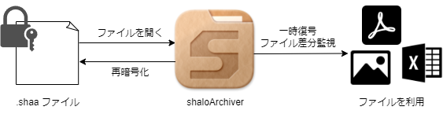
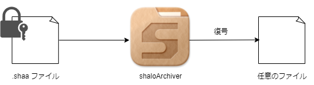

# shaloArchiver

[SHALO AUTH](https://shalo.jp/auth/) を使用して、コンピュータ上にある任意のファイルを暗号化・復号するツールです。

## 特徴

1. ファイルの復号に必要な秘密鍵は SHALO AUTH 内部に格納されています。この鍵は決して外部に取り出せないため、安全性が高いです。
2. 適合する秘密鍵が入った SHALO AUTH がないとファイルを開けないようにすることができるため、情報の保護などに役立ちます。
3. GUI による簡単な操作で、手軽にファイルを暗号化・復号できます。
4.  暗号化されたファイルをダブルクリックすると、自動的に一時復号して開くことができます。
5. 一時復号したファイルを編集して保存した場合、shaloArchiver はそれを検知して再暗号化します。したがって、ワープロソフトや表計算ソフトで扱うような、編集作業が必要なファイルにも、shaloArchiver による保護を適用できます。

## インストール方法

現在、Windows 10 以降の環境にのみ対応しております。

### SHALO AUTH PKCS#11 モジュールのインストール（必須）

[SHALO AUTH サポートページ](https://auth.shalo.jp/) から、PKCS#11 モジュールをダウンロードします。

ダウンロードした zip アーカイブを展開し、中にある `shaloPKCS#11Installer.exe` を実行することで、インストールが完了します。

### shaloArchiver のインストール

本レポジトリの [Releases ページ](https://github.com/axell-corp/shalo-archiver/releases) に、最新のバイナリがあります。

あるいは、以下のリンクからもダウンロードしていただけます。

[shaloArchiver-1.0.0-setup.exe](https://github.com/axell-corp/shalo-archiver/releases/download/v1.0.0/shaloArchiver-1.0.0-setup.exe)（68.8 MBytes）

ダウンロードした exe ファイルを実行することで、自動的にインストールが完了します。

### SHALO Keyring のインストール（オプション）

SHALO Keyring は、SHALO AUTH のセットアップをしたり、格納されている鍵の管理を行ったりするためのアプリケーションです。
[SHALO AUTH サポートページ](https://auth.shalo.jp/) からダウンロードできます。

shaloArchiver にも簡易的な鍵管理機能が付属していますが、より高度な操作が必要な場合は SHALO Keyring をインストールすることをお勧めします。

> ![IMPORTANT]
> はじめて SHALO AUTH を使う場合は、初期設定のために SHALO Keyring をインストールする必要があります。

## 実行例

本アプリケーションでできる操作を簡単に説明します。

### ファイルを暗号化する

任意のファイルを暗号化します。暗号化されたファイルの拡張子は、`.shaa` に変化します。

1. 「暗号化するファイル」欄に、暗号化したいファイルを指定する。
2. 「出力先ディレクトリ」欄に、暗号化した結果の shaa ファイルを出力したいフォルダを指定する。
3. 「鍵ID」欄で、暗号化に使用する鍵を指定する。あとで暗号化したファイルを開くには、ここで指定したものと同じ鍵が入った SHALO AUTH を刺す必要がある。
4. 「暗号化」ボタンを押し、「暗号化に成功しました」というメッセージが出たら完了。

### 暗号化されたファイルを開く

暗号化された `.shaa` ファイルを開きます。shaloArchiver はファイルの種類を自動で判別して、それに適したアプリケーションを起動します。

1. 暗号化された shaa ファイルをダブルクリックして開く。
2. 正しい鍵の入った SHALO AUTH が刺されていれば、自動的に shaloArchiver が起動し、PIN を入力する画面が表示される。
3. SHALO AUTH の初期設定時に指定したユーザパスワードを入力して、ボタンを押す。
4. ファイルを開くのに最適なアプリケーションが自動で起動する。
5. アプリケーション上でファイルを編集して上書き保存すると、shaloArchiverがそれを検知して再暗号化し、shaa ファイルの内容も同時に更新される。この際、shaloArchiverから「再暗号化に成功しました」というメッセージが出力される。
6. ファイルの利用が終わったら、開いているアプリケーションを終了する。shaloArchiverも同時に自動で終了する。

### ファイルを復号する

暗号化された `.shaa` ファイルを復号します。暗号化される前のデータと同じものを得ることができます。

1. 「復号するファイル」欄に、復号したい shaa ファイルを指定する。
2. 「出力先ディレクトリ」欄に、復号した結果のファイルを出力したいフォルダを指定する。
3. 「PIN」欄に、SHALO AUTH の初期設定時に指定したユーザパスワードを入力する。
4. 「復号」ボタンを押し、「復号に成功しました」というメッセージが出たら完了。

### SHALO AUTH 内の鍵を管理する

鍵の生成と、インポートができます。

> [!IMPORTANT]
> shaloArchiver には、鍵の閲覧や削除機能がありません。これらの操作を行いたい場合は、前述した SHALO Keyring を使用してください。

#### 鍵の生成

PEM（Privacy-Enhanced Mail）形式でエンコードされた RSA2048bit 鍵を生成する。

1. 「出力先ディレクトリ」欄に、鍵ファイルを出力したいフォルダとファイル名を指定する。
2. 「生成」ボタンを押し、「鍵生成に成功しました」というメッセージが出たら完了。

#### 鍵のインポート

PEM 形式でエンコードされた RSA2048bit 鍵を、SHALO AUTH にインポートする。

1. 「インポートする鍵ファイル」欄に、インポートしたい鍵ファイルを指定する。
2. 「インポート先の鍵 ID」欄に、インポート先の番号を指定する。SHALO AUTH は最大で同時に4つの鍵を保存することができるため、ここの値は1~4のいずれかをとる。
3. 「サブジェクト」欄に、鍵の名前を入力する。この欄が空の場合、サブジェクトは付与されない。
4. 「有効期限」欄に、鍵の有効期限を入力する。この欄が空の場合、自動的に1年後まで有効として設定される。
6. 「PIN」欄に、SHALO AUTH の初期設定時に指定したユーザパスワードを入力する。
7. 「インポート」ボタンを押し、「鍵のインポートに成功しました」というメッセージが出たら完了。

## 不具合報告・サポート

お問い合わせ・不具合の報告は、本レポジトリの [Issue ページ](https://github.com/axell-corp/shalo-archiver/issues) からお願いします。

メールの場合は、shalo@axell.co.jp までお寄せください。

## 開発者向け情報

アプリケーションのビルドのための情報は、[別ドキュメント](./BUILDING.md) に記載してあります。

## ライセンス

Copyright (C) 2023 AXELL CORPORATION

This repository is licensed under the MIT License.
